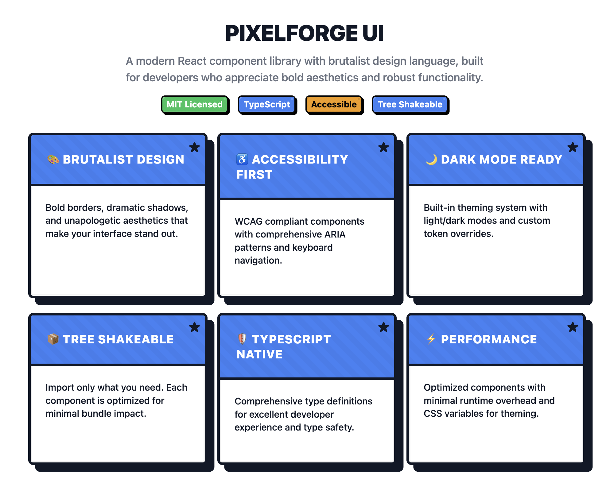

# PixelForge UI



[](https://opensource.org/licenses/MIT)
[](https://www.npmjs.com/package/@pixelforge-ui/react)
[](https://github.com/pixelforge-ui/pixelforge-ui/actions)
[](http://www.typescriptlang.org/)

**A bold, unapologetic React component library featuring brutalist design elements, aggressive accessibility, and uncompromising type safety.**

PixelForge UI brings together industrial-strength design tokens, brutal aesthetics, and production-ready components for applications that demand attention and deliver results.

## 🔥 Design Philosophy

- **Bold & Uncompromising** - Sharp borders, dramatic shadows, high contrast
- **Accessibility-First** - WCAG 2.1 AA compliance built into every component
- **Performance-Driven** - Minimal runtime, maximum impact
- **Developer-Focused** - Comprehensive TypeScript support and intuitive APIs

## 📦 Packages

| Package | Description | Version | Size |
|---------|-------------|---------|------|
| [`@pixelforge-ui/core`](./packages/core) | Design tokens, theme provider, and utilities | [](https://www.npmjs.com/package/@pixelforge-ui/core) |  |
| [`@pixelforge-ui/react`](./packages/react) | React components with brutalist design | [](https://www.npmjs.com/package/@pixelforge-ui/react) |  |
| [`@pixelforge-ui/icons`](./packages/icons) | Brutalist icon set with React components | [](https://www.npmjs.com/package/@pixelforge-ui/icons) | 
 |

## ⚡ Quick Start

```bash
# Install the React components package
npm install @pixelforge-ui/react @pixelforge-ui/core

# Or with pnpm
pnpm add @pixelforge-ui/react @pixelforge-ui/core
```

```tsx
import { Button, Input, Typography, ThemeProvider } from '@pixelforge-ui/react';

function App() {
  return (
    <ThemeProvider defaultMode="system">
      <Typography variant="h1">WELCOME TO PIXELFORGE</Typography>
      <Input 
        label="Email" 
        type="email" 
        placeholder="Enter your email"
        required 
      />
      <Button variant="primary" size="lg">
        GET STARTED
      </Button>
    </ThemeProvider>
  );
}
```

## 🎨 Features

### Core Capabilities
- **🎯 TypeScript-First** - Complete type safety with intelligent autocompletion
- **🌙 Dark Mode Ready** - Seamless theme switching with system preference detection
- **📱 Responsive Design** - Mobile-first approach with brutalist flair
- **🌳 Tree Shakeable** - Import only what you need for optimal bundle sizes
- **⚡ Performance Optimized** - CSS variables for theming, minimal JavaScript runtime

### Design System
- **🎨 Comprehensive Tokens** - Colors, typography, spacing, shadows, and motion
- **🔧 Customizable Themes** - Override any design token to match your brand
- **📐 Consistent Spacing** - Harmonious spacing scale based on design principles
- **🎭 Brutalist Aesthetics** - Bold borders, dramatic shadows, high contrast

### Accessibility
- **♿ WCAG 2.1 AA Compliant** - Extensively tested with automated and manual audits
- **⌨️ Keyboard Navigation** - Full keyboard support for all interactive components
- **🔍 Screen Reader Optimized** - Proper ARIA attributes and semantic markup
- **🎯 Focus Management** - Clear focus indicators and logical tab order

## 🏗️ Components

### Core Components
- **Button** - Multiple variants with loading states and icon support
- **Input** - Text inputs with validation, icons, and helper text
- **Typography** - Comprehensive text styling with semantic variants
- **Container** - Responsive layout containers with grid system

### Advanced Components
- **Modal** - Accessible dialogs with focus trapping and backdrop handling
- **Alert** - Notification system with toast support and auto-dismiss
- **Card** - Content containers with brutalist design elements
- **Badge** - Status indicators and labels

### Icons
- **Comprehensive Icon Set** - Carefully crafted brutalist icons
- **React Components** - Tree-shakeable icon imports
- **Customizable** - Size, color, and styling props

## 🛠️ Development

### Prerequisites
- Node.js 18+ 
- pnpm 8+

### Setup
```bash
# Clone the repository
git clone https://github.com/pixelforge-ui/pixelforge-ui.git
cd pixelforge-ui

# Install dependencies
pnpm install

# Run tests
pnpm test

# Build all packages
pnpm build

# Start Storybook for component development
pnpm storybook

# Run linting and formatting
pnpm lint
pnpm format
```

### Monorepo Structure
```
pixelforge-ui/
├── packages/
│   ├── core/           # Design tokens and theme utilities
│   ├── react/          # React components
│   └── icons/          # Icon components
├── stories/            # Storybook stories
├── .github/            # GitHub Actions workflows
└── docs/               # Documentation
```

## 📚 Documentation

- **[Storybook](https://pixelforge-ui.github.io/pixelforge-ui/)** - Interactive component documentation
- **[Core Package](./packages/core/README.md)** - Design tokens and theming
- **[React Package](./packages/react/README.md)** - Component library
- **[Icons Package](./packages/icons/README.md)** - Icon components

## 🌐 Browser Support

- Chrome 90+
- Firefox 88+
- Safari 14+
- Edge 90+

## 🤝 Contributing

We welcome contributions! Please see our [Contributing Guide](./CONTRIBUTING.md) for details.

### Quick Contribution Steps
1. Fork the repository
2. Create a feature branch: `git checkout -b feature/amazing-feature`
3. Make your changes and add tests
4. Run the test suite: `pnpm test`
5. Submit a pull request

## 📄 License

MIT License - see the [LICENSE](./LICENSE) file for details.

## 🏆 Built With

- **TypeScript** - Type safety and developer experience
- **React** - Component architecture and hooks
- **CSS Modules** - Scoped styling with CSS variables
- **Jest & Testing Library** - Comprehensive testing suite
- **Storybook** - Component development and documentation
- **GitHub Actions** - Automated testing and publishing

---

**Made with ❤️ and countless late nights by a developer passionate about bold design and beautiful user experiences.**