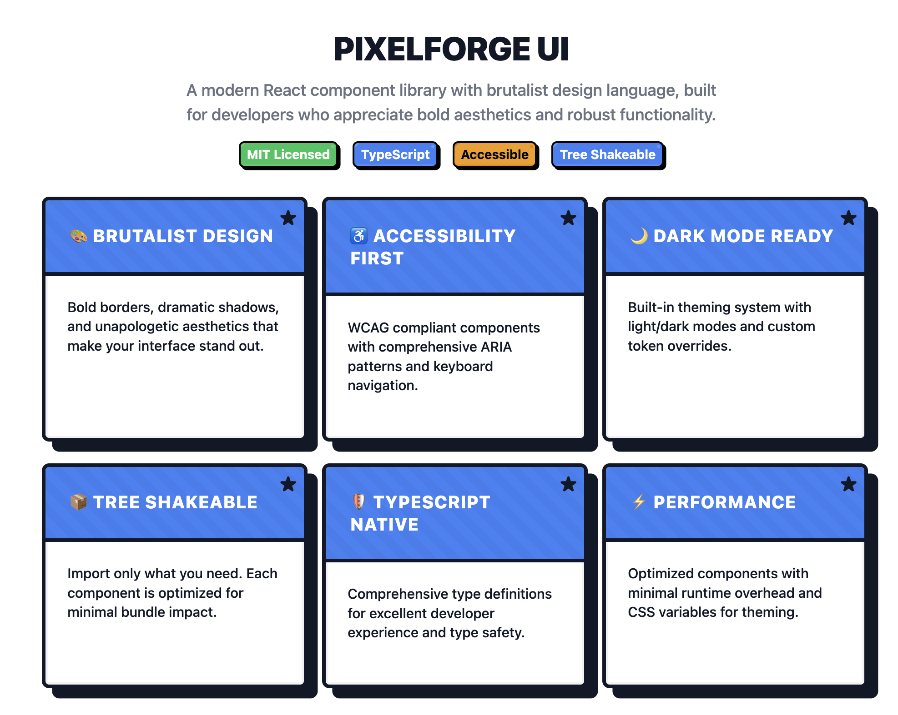

# @pixelforge-ui/icons



React icon components for PixelForge UI component library.

## Installation

```bash
npm install @pixelforge-ui/icons
```

## Features

- 🎯 **TypeScript** - Full type safety for all icons
- ⚡ **Tree Shakeable** - Import only the icons you need
- 🎨 **Customizable** - Resize, recolor, and style easily
- ♿ **Accessible** - Built with accessibility in mind
- 📦 **Small Bundle** - Lightweight SVG icons

## Quick Start

```tsx
import { Check, X, AlertCircle, Star } from '@pixelforge-ui/icons';

function MyComponent() {
  return (
    <div>
      <Check size={24} color="green" />
      <X size={20} color="red" />
      <AlertCircle size={16} />
      <Star color="#fbbf24" />
    </div>
  );
}
```

## Available Icons

### Common Icons
- `Check` - Checkmark icon
- `X` - Close/X icon
- `ChevronDown` - Dropdown arrow
- `AlertCircle` - Warning/error circle
- `Info` - Information circle
- `Star` - Star icon

### Aliases for Convenience
- `CloseIcon` - Same as `X`
- `SuccessIcon` - Same as `Check`
- `WarningIcon` - Same as `AlertCircle`
- `InfoIcon` - Same as `Info`

## Icon Props

All icons accept the following props:

```tsx
interface IconProps extends React.SVGAttributes<SVGElement> {
  size?: number | string;  // Default: 24
  color?: string;          // Default: 'currentColor'
}
```

## Examples

### Basic Usage

```tsx
import { Check, X } from '@pixelforge-ui/icons';

<Check />                    // Default size (24px)
<X size={16} />             // Custom size
<AlertCircle color="red" />  // Custom color
```

### Custom Base Icon

```tsx
import { Icon } from '@pixelforge-ui/icons';

const CustomIcon = (props) => (
  <Icon {...props}>
    <circle cx="12" cy="12" r="10" />
    <path d="M8 12h8M12 8v8" />
  </Icon>
);
```

### Styling with CSS

```tsx
import { Star } from '@pixelforge-ui/icons';

// CSS class styling
<Star className="text-yellow-500 hover:text-yellow-600" />

// Inline styles
<Star style={{ color: '#fbbf24', cursor: 'pointer' }} />
```

## Accessibility

Icons include proper accessibility features:

```tsx
// Add aria-label for screen readers
<Check aria-label="Success" />

// Or use with aria-hidden if decorative
<Star aria-hidden="true" />
```

## TypeScript

Full TypeScript support with proper type definitions:

```tsx
import type { IconProps } from '@pixelforge-ui/icons';

const MyIconComponent: React.FC<IconProps> = (props) => {
  return <Check {...props} />;
};
```

## Package Info

- **Bundle Size**: ~2KB gzipped
- **Dependencies**: React (peer dependency)
- **License**: MIT
- **TypeScript**: Full support with declarations

## Related Packages

- [`@pixelforge-ui/react`](https://www.npmjs.com/package/@pixelforge-ui/react) - React UI components
- [`@pixelforge-ui/core`](https://www.npmjs.com/package/@pixelforge-ui/core) - Design tokens and theming

---

Built with ❤️ by the PixelForge team